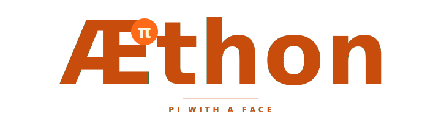
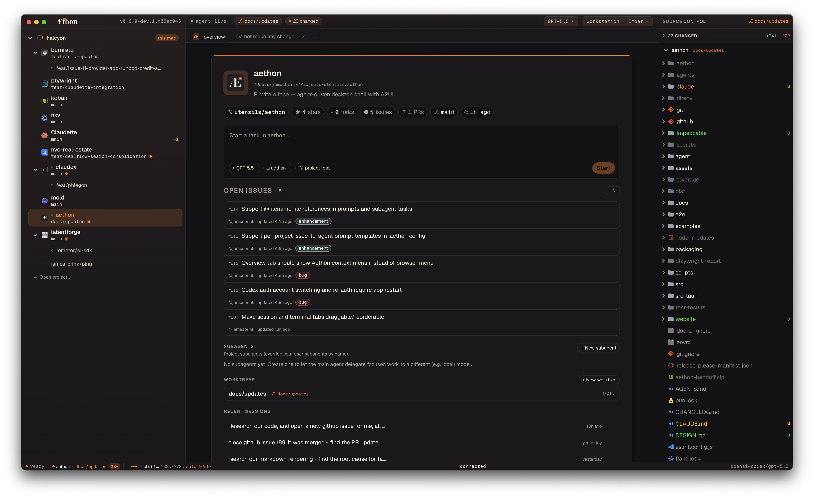
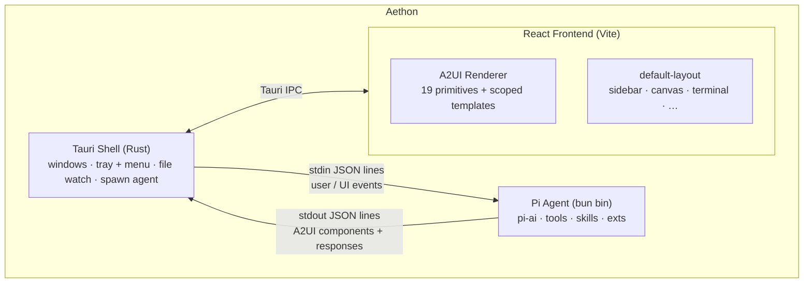

<p align="center">
  
</p>

<p align="center">
  <em>An agent-driven desktop shell where the agent decides what you see.</em>
</p>

<p align="center">
  <a href="LICENSE"></a>
  
  
  
  
  
  
  
</p>

> **Early development — not ready for production use.** The API and protocol surface are still settling; expect breaking changes between commits.

Aethon embeds the [pi coding agent][pi] inside a Tauri 2 desktop shell and renders its output as live, interactive UI via the [A2UI][a2ui] protocol. The interface is not a fixed IDE layout — it's a **canvas the agent populates dynamically**. Extensions bring their own components, themes control the look, the agent decides the layout.

The name comes from Greek mythology: _Αἴθων_, one of the horses that pulled Helios's sun chariot. The blazing one that shapes what you see.

<p align="center">
  
</p>

[pi]: https://github.com/mariozechner/pi-coding-agent
[a2ui]: https://github.com/google/a2ui

---

## What it can do

- **Multi-tab workspace** — top-strip agent tabs (one pi conversation each) plus a bottom-panel terminal with sub-tabs: a read-only "Agent bash" stream and zero-or-more interactive PTY shells (xterm.js + WebGL, full TUI / 256-color / true-color). Focus-aware `⌘T`, `⌘1`–`⌘9` jump, `⌘W` close, `⌘⌥T` reopen.
- **Project worktrees** — projects expand into git worktrees in the sidebar. New worktrees fork from `origin/main` by default, can be configured per project, and GitHub issue "Send to agent" can use per-repo `.aethon/issues.toml` handoff templates plus branch names inferred from the issue title/labels.
- **Native shell integration** — system tray + macOS menu, auto-updater (`tauri-plugin-updater` against GitHub Releases), persistent chat history / tabs / themes / projects / `~/.aethon/config.toml`, per-tab pi session continuity.
- **Agent-controlled UI** — themes (`aethon.registerTheme` or `~/.aethon/themes/*.json`) drive the whole palette including terminal ANSI; any A2UI built-in (composites or app-root overlays like `command-palette`, `notification-stack`, `settings-panel`, `search-panel`) is overridable via `aethon.registerComponent`. One built-in layout (`workstation`); extensions register more via `aethon.registerLayout`.
- **Agent ↔ shell sharing** — four-value `shareMode` (`private` / `read` / `read-write` / `read-write-trusted`) per shell, clickable badge to cycle. Bridge surface `aethon.shells.{list, read, write}` exposes scrollback (forward-only, privacy floor enforced Rust-side) and keystroke injection (Allow/Deny prompt per write unless trusted).
- **First-class Nix devshell support** — projects with `flake.nix`, `.envrc` (`use_flake` + `direnv`), or `shell.nix` get their devshell env auto-applied to every PTY shell tab AND the agent's pi `bash` tool, no manual `nix develop` wrap needed. One in-memory + on-disk cache keyed on `flake.lock` hash feeds both spawn paths; status-bar `⬡ direnv` / `⬡ flake` badge shows current state. Configurable via `[devshell]` in `config.toml` and per-project `.aethon/devshell.toml`.
- **Voice input** — push-to-talk dictation straight into the composer (`Cmd+Shift+M`, plus an optional hold-to-record key). Transcription provider is selectable per host: a bundled local Whisper model (downloaded on demand) or the native OS recognizer (macOS Speech, Windows SAPI 5.4). Hotkeys configurable via `[voice]` in `config.toml`.
- **Multiple provider accounts** — sign in to more than one account per provider and switch which one a tab uses with `/login [list | use <account> | default <account>]`. Each profile keeps its own credentials and model registry; the active profile is per-tab with a per-provider default.
- **Extensibility** — drop a `.ts` into `~/.aethon/extensions/` for hot-reload, or `npm install --prefix ~/.aethon/extensions <pkg>` for npm-distributed extensions (manifest via `package.json#aethon`); project-local extensions discovered from cwd up to its git root. Extensions register slash commands, keybindings, menu items, event routes, layouts, A2UI components, and themes — all reported back in the runtime snapshot.
- **Built-in slash commands** — `/clear`, `/help`, `/theme`, `/model`, `/login`, `/reset`, `/reload`, `/rename`, `/context`, `/session`, `/compact`, `/name`, `/export`, `/terminal`, `/extensions`, `/sidebar`, `/files`, `/layout`, `/project`. Unknown commands fall through to pi.

See [`SPEC.md`](SPEC.md) for the full status checklist, [`docs/project-config.md`](docs/project-config.md) for project-local `.aethon` config, and [`CHANGELOG.md`](CHANGELOG.md) for release notes.

---

## Getting started

Requires [Nix][nix] with flakes enabled. With [direnv][direnv], the dev shell activates automatically when you `cd` into the directory.

```bash
nix develop          # enter the dev shell (rust toolchain + bun + tauri CLI)
bun install          # install JS deps
dev                  # launch the app with hot reload
```

Bring your own LLM key — pi reads `ANTHROPIC_API_KEY` / `OPENAI_API_KEY` / equivalents from the environment. See pi's docs for the full multi-provider setup.

[nix]: https://nixos.org/download
[direnv]: https://direnv.net

### Nix package

The flake also exposes a distribution package and overlay:

```bash
nix build .#aethon
nix run .#aethon
```

Downstream flakes can consume `overlays.default`, which provides `pkgs.aethon`.
The package follows nixpkgs' Tauri pattern (`cargo-tauri.hook` +
`fetchNpmDeps`) and uses `package-lock.json` as the reproducible npm dependency
input for Nix builds.

### Devshell commands

| Command     | What it does                                                                                |
| ----------- | ------------------------------------------------------------------------------------------- |
| `dev`       | Launch the app with hot reload (auto-increments Vite + debug ports if 1420/19433 are busy)  |
| `docs`      | Run the VitePress docs site on `0.0.0.0:5173` with hot reload                               |
| `build-app` | Release bundle (`.app` / `.dmg` on macOS, `.deb` / `.rpm` on Linux, NSIS `.exe` on Windows) |
| `check`     | Full CI gate: clippy + tsc + ESLint + cargo test + vitest                                   |
| `lint`      | ESLint frontend + agent (no auto-fix)                                                       |
| `test`      | Run Rust + TS tests (cargo test --lib + vitest run)                                         |
| `coverage`  | TS coverage report under `coverage/` (vitest v8)                                            |
| `fmt`       | Format Rust + Nix + JSON/MD/YAML/CSS + TOML with treefmt                                    |
| `clean`     | Remove Rust build artifacts under `src-tauri/target/`                                       |

### Versioning

`package.json` is the app-version source of truth. The sidebar version
chip imports it directly, while `scripts/sync-version.mjs` mirrors it into
Tauri and Cargo metadata.

```bash
bun run version:sync   # update package-lock, tauri.conf, Cargo.toml, Cargo.lock
bun run version:check  # fail if any copy drifted from package.json
```

---

## Architecture



| Layer                  | Owns                                                                                    | Doesn't own                                                     |
| ---------------------- | --------------------------------------------------------------------------------------- | --------------------------------------------------------------- |
| **Tauri shell (Rust)** | OS surface — windows, tray, native menus, file watcher, spawning the agent subprocess   | Any business logic, agent awareness, A2UI knowledge             |
| **Pi agent (Bun)**     | LLM interaction, tool execution, session management, extension loading, A2UI emission   | OS resources                                                    |
| **React frontend**     | Rendering A2UI payloads, dispatching events, persisting local state, hosting the chrome | The chrome is data — `default-layout` is itself an A2UI payload |

The default layout is an extension (`src/extensions/default-layout/`). Replacing it requires no React changes — just register a different layout payload via `aethon.setLayout(...)`.

---

## Project layout

```text
aethon/
├── src/                 # React frontend (entry: src/main.tsx)
├── src-tauri/           # Rust Tauri shell (lib + helpers + watcher)
├── agent/               # Pi agent bridge (run as a bun subprocess)
├── docs/aethon-agent/   # Bundled reference docs the agent reads
├── examples/            # Pi extensions + extension packages (reference)
├── flake.nix            # Nix dev environment, package, and overlay
├── bun.lock             # Bun lockfile (used by `bun install` in the devshell)
├── package-lock.json    # npm dependency snapshot for reproducible Nix builds
└── package.json         # App version source + frontend deps + tauri CLI
```

For agent-side authoring docs (the API surface, A2UI components, extension recipes), see [`docs/aethon-agent/`](docs/aethon-agent/). The same files ship inside the binary as bundled resources so the agent can read them at runtime.

For repository conventions and architecture deep-dives, see [`CLAUDE.md`](CLAUDE.md).

---

## Releasing

[`RELEASING.md`](RELEASING.md) walks through generating an updater signing keypair, configuring GitHub Actions secrets, and cutting a release that the in-app updater can consume.

---

## License

[MIT](LICENSE) © James Brink

<sub>Aethon is independent of and not affiliated with Anthropic. Pi is © its respective authors.</sub>
