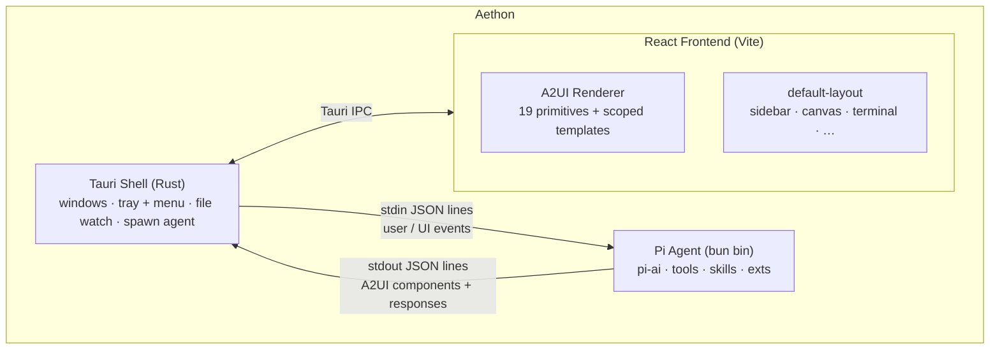

<p align="center">
  <picture>
    <source media="(prefers-color-scheme: dark)" srcset="assets/brand/aethon-hero-light.svg">
    
  </picture>
</p>

<p align="center">
  <em>An agent-driven desktop shell where the agent decides what you see.</em>
</p>

<p align="center">
  <a href="LICENSE"></a>
  
  
  
  
  
  
  
</p>

> **Early development — not ready for production use.** The API and protocol surface are still settling; expect breaking changes between commits.

Aethon embeds the [pi coding agent][pi] inside a Tauri 2 desktop shell and renders its output as live, interactive UI via the [A2UI][a2ui] protocol. The interface is not a fixed IDE layout — it's a **canvas the agent populates dynamically**. Skills bring their own components, themes control the look, the agent decides the layout.

The name comes from Greek mythology: _Αἴθων_, one of the horses that pulled Helios's sun chariot. The blazing one that shapes what you see.

[pi]: https://github.com/mariozechner/pi-coding-agent
[a2ui]: https://github.com/google/a2ui

---

## What it can do

**Workspace**

- Multi-tab sessions — top-strip agent tabs (each owning a pi conversation, model, draft, and bash buffer) and bottom-panel shell sub-tabs (interactive PTY-backed terminals). `⌘T` is focus-aware: shell sub-tab when focus is in the bottom panel, agent tab elsewhere; `⌘⇧T` flips the default; `⌘1`–`⌘9` jump, `⌘W` closes, `⌘⌥T` reopens the most-recently-closed.
- Native macOS menu + system tray — built-ins (Quit, Hide, Cut/Copy/Paste, Minimize) for free, plus app-specific items (New Tab, Toggle Terminal, Stop Prompt, Check for Updates) that route through the same dispatcher as the keyboard shortcuts.
- Tabbed terminal panel (`⌘\``) — xterm.js with the WebGL renderer. Hosts a read-only "Agent bash" sub-tab streaming the active agent's bash output, plus zero or more interactive shell sub-tabs. Full TUI support (vim, htop, fzf), 256-color and true-color, theme-aware ANSI palette via CSS variables.
- Settings panel (`⌘,`) and cross-session search (`⌘⇧F`) — both registered builtins; an extension can replace either via `aethon.registerComponent`.
- Auto-updater wired via `tauri-plugin-updater` — checks the GitHub Releases manifest, downloads with progress, and relaunches.
- Persistent state — chat history, tabs (agent + shell), themes, projects, and `~/.aethon/config.toml` settings survive relaunch. Pi LLM context persists per tab via pi's session manager.

**Agent-controlled UI**

- Themes registered live via `aethon.registerTheme({ id, vars })` or dropped as `~/.aethon/themes/*.json`. Themes drive the entire palette — including the terminal's ANSI swatches.
- Custom A2UI components shipped from extensions — visible alongside the built-ins inside the same renderer. Templates registered via `aethon.registerComponent("<type>", …)` win over the default React component, so any built-in can be replaced declaratively.
- App-root overlays (`command-palette`, `notification-stack`, `settings-panel`, `search-panel`, `share-mode-badge`) all mount through the registry — overridable from a skill without forking the chrome.
- Layout slot contract — alternative layouts host the standard composites by adhering to canonical area names (`canvas`, `composer`, `sidebar`, `tabs`, `terminal`, `status`, `header`, `empty-state`) or by declaring a `slotMap` remap.
- One built-in layout (`workstation`) while we focus polish on a single surface; extensions register additional layouts via `aethon.registerLayout` and switch with `/layout <id>`.

**Agent ↔ shell sharing (opt-in)**

- Each shell tab carries a four-value `shareMode` (`private` / `read` / `read-write` / `read-write-trusted`) and a clickable badge in the status line cycles through them. Default is `private` (configurable per-tab and globally via `[shell] default_share_mode`).
- The bridge surface is `aethon.shells.{list, read, write}` — extensions and the agent can enumerate shareable tabs, page scrollback (forward-cursor, no rewind past the privacy floor), and inject keystrokes (each `read-write` write needs an Allow/Deny user prompt; `read-write-trusted` skips it).
- Privacy floor is enforced Rust-side in `shell.rs`; agents cannot see scrollback from before the user opted in, and `setShareMode` is intentionally absent from the agent surface.

**Extensibility**

- Drop a `.ts` into `~/.aethon/extensions/` — the bridge hot-reloads. Or `npm install --prefix ~/.aethon/skills <pkg>` to install an npm-distributed extension package (manifest via `package.json#aethon`; the on-disk `skills/` directory name is retained for back-compat with existing installs). Project-local extensions discovered from the active cwd up to its git root via `.aethon/extensions/`.
- Slash commands, keybindings, menu items, and event interceptors — all registerable from extensions, all reported back in the runtime snapshot so the agent knows what's wired.
- Generic `extension_lifecycle` event channel — extensions get visible chat-side feedback when they load / fail / reload, and other layouts can intercept the window event to substitute a toast / sidebar pulse / status pill.

**Slash commands** — `/clear`, `/help`, `/theme`, `/model`, `/reset`, `/terminal`, `/extensions`, `/sidebar`, `/layout`, `/project`. Unknown commands fall through to pi.

See [`SPEC.md`](SPEC.md) for the full status checklist and [`CHANGELOG.md`](CHANGELOG.md) for release notes.

---

## Getting started

Requires [Nix][nix] with flakes enabled. With [direnv][direnv], the dev shell activates automatically when you `cd` into the directory.

```bash
nix develop          # enter the dev shell (rust toolchain + bun + tauri CLI)
bun install          # install JS deps
dev                  # launch the app with hot reload
```

Bring your own LLM key — pi reads `ANTHROPIC_API_KEY` / `OPENAI_API_KEY` / equivalents from the environment. See pi's docs for the full multi-provider setup.

[nix]: https://nixos.org/download
[direnv]: https://direnv.net

### Nix package

The flake also exposes a distribution package and overlay:

```bash
nix build .#aethon
nix run .#aethon
```

Downstream flakes can consume `overlays.default`, which provides `pkgs.aethon`.
The package follows nixpkgs' Tauri pattern (`cargo-tauri.hook` +
`fetchNpmDeps`) and uses `package-lock.json` as the reproducible npm dependency
input for Nix builds.

### Devshell commands

| Command     | What it does                                                                                |
| ----------- | ------------------------------------------------------------------------------------------- |
| `dev`       | Launch the app with hot reload (auto-increments Vite + debug ports if 1420/19433 are busy)  |
| `build-app` | Release bundle (`.app` / `.dmg` on macOS, `.deb` / `.rpm` on Linux, NSIS `.exe` on Windows) |
| `check`     | Full CI gate: clippy + tsc + ESLint + cargo test + vitest                                   |
| `lint`      | ESLint frontend + agent (no auto-fix)                                                       |
| `test`      | Run Rust + TS tests (cargo test --lib + vitest run)                                         |
| `coverage`  | TS coverage report under `coverage/` (vitest v8)                                            |
| `fmt`       | Format Rust + Nix with treefmt                                                              |

---

## Architecture



| Layer                  | Owns                                                                                    | Doesn't own                                                     |
| ---------------------- | --------------------------------------------------------------------------------------- | --------------------------------------------------------------- |
| **Tauri shell (Rust)** | OS surface — windows, tray, native menus, file watcher, spawning the agent subprocess   | Any business logic, agent awareness, A2UI knowledge             |
| **Pi agent (Bun)**     | LLM interaction, tool execution, session management, extension loading, A2UI emission   | OS resources                                                    |
| **React frontend**     | Rendering A2UI payloads, dispatching events, persisting local state, hosting the chrome | The chrome is data — `default-layout` is itself an A2UI payload |

The default layout _is_ a skill (`src/skills/default-layout/`). Replacing it requires no React changes — just register a different layout payload via `aethon.setLayout(...)`.

---

## Project layout

```
aethon/
├── src/                 # React frontend (entry: src/main.tsx)
├── src-tauri/           # Rust Tauri shell (lib + helpers + watcher)
├── agent/               # Pi agent bridge (run as a bun subprocess)
├── docs/aethon-agent/   # Bundled reference docs the agent reads
├── examples/            # Pi extensions + extension packages (reference)
├── flake.nix            # Nix dev environment, package, and overlay
├── bun.lock             # Bun lockfile (used by `bun install` in the devshell)
├── package-lock.json    # npm dependency snapshot for reproducible Nix builds
└── package.json         # Frontend deps + tauri CLI
```

For agent-side authoring docs (the API surface, A2UI components, extension recipes), see [`docs/aethon-agent/`](docs/aethon-agent/). The same files ship inside the binary as bundled resources so the agent can read them at runtime.

For repository conventions and architecture deep-dives, see [`CLAUDE.md`](CLAUDE.md).

---

## Releasing

[`RELEASING.md`](RELEASING.md) walks through generating an updater signing keypair, configuring GitHub Actions secrets, and cutting a release that the in-app updater can consume.

---

## License

[MIT](LICENSE) © James Brink

<sub>Aethon is independent of and not affiliated with Anthropic. Pi is © its respective authors.</sub>
